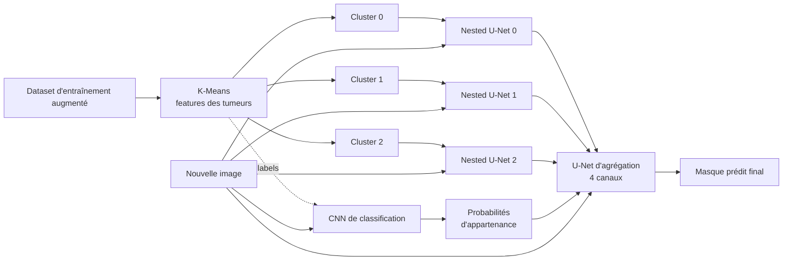

# Segmentation de tumeurs cérébrales par U-Net et spécialisation par clustering

Projet de Machine Learning réalisé à **Centrale Casablanca** par **Louca Malerba**, **Antoine Mazet** et **Mathys Piet**.

L'objectif est d'implémenter nous-mêmes (sans passer par nnU-Net) un pipeline complet de segmentation sémantique de tumeurs cérébrales sur IRM 2D : d'un U-Net vanilla jusqu'à une pipeline de modèles spécialisés par type de tumeur, agrégés par un méta-modèle.

---

## Résultats en bref

| Modèle | Dice Score |
|---|---|
| U-Net vanilla `[64,128,256,512,1024]`, 128×128 | 0.72 |
| Attention U-Net (Dice × Focal, α=0.75) | 0.74 |
| Nested U-Net (U-Net++) + Squeeze-and-Excitation, 30 époques | 0.816 |
| Nested U-Net + SE, entraînement complet 100 époques | **0.835** |
| Nested U-Net spécialisés par cluster (0 / 1 / 2) | 0.85 / 0.92 / 0.90 |
| **Pipeline complète** (CNN de routage + 3 modèles spécialisés + U-Net d'agrégation) | **≈ 0.85 – 0.865** |

---

## Dataset

https://www.kaggle.com/datasets/nikhilroxtomar/brain-tumor-segmentation

- **3064 paires** image IRM / masque binaire
- **100 % des images contiennent une tumeur** → le modèle segmente une tumeur *sachant* qu'il y en a une (pas de détection de présence)
- Forte variabilité d'intensité (tumeurs très contrastées vs. peu visibles)
- Déséquilibre des tailles : majorité de petites tumeurs (médiane 3366 px, max 25 461 px)
- Excentricité très étalée (0.12 → 0.98), solidité majoritairement proche de 1 avec quelques tumeurs non convexes

| Statistique | tumor_area | tumor_ratio | mean_intensity | eccentricity | solidity |
|---|---|---|---|---|---|
| Moyenne | 4422 | 0.017 | 88.33 | 0.651 | 0.943 |
| Médiane | 3366 | 0.013 | 89.65 | 0.670 | 0.967 |
| Min | 163 | 0.001 | 16.38 | 0.115 | 0.485 |
| Max | 25461 | 0.097 | 186.40 | 0.983 | 0.992 |

---

## Pipeline finale

1. **Augmentation des données** : rotations, translations, changements d'échelle, flips, déformations élastiques, bruit, correction gamma… (3064 → 3064 × n paires).
2. **Clustering K-Means** sur des caractéristiques extraites *sous le masque* (surface, périmètre, excentricité, intensités min/max/moyenne/médiane…). Méthode du coude → **k = 3**.
3. **CNN de classification** : prédit, pour une nouvelle image (sans masque), les probabilités d'appartenance à chaque cluster. Entrée 128×128, filtres `[64, 128, 256]`, 3 classes.
4. **3 Nested U-Net spécialisés**, un par cluster.
5. **Agrégation par U-Net** : entrée à 4 canaux = image en niveaux de gris + les 3 masques prédits pondérés par la probabilité du cluster correspondant. (Une agrégation par vote majoritaire / seuils a aussi été testée, avec de moins bons résultats.)

---

## Expériences

### Taille du réseau et résolution (U-Net vanilla)

| Architecture | 256×256 | 128×128 |
|---|---|---|
| `[64,128,256,512]` | 0.65 | 0.63 |
| `[64,128,256,512,1024]` | 0.75 | 0.71 |
| `[32,64,128,256,512]` | – | 0.55 |
| `[32,64,128,256,512,1024]` | – | 0.01 (non convergé) |

→ Passer de 256×256 à 128×128 ne coûte qu'environ 0.04 de Dice : la résolution **128×128** a été retenue pour la suite. Une couche à 2048 filtres rendait l'entraînement trop long.

### Fonction de perte (`[64,…,1024]`, 128×128, 8 époques)

| Loss | Dice |
|---|---|
| BCEWithLogits | 0.63 |
| **Dice Loss** | **0.72** |
| Cross Entropy | 0.025 |
| IoU Loss | 0.71 |
| Focal Loss | 0.70 |
| Dice × Focal (α=0.5) | 0.70 |
| **Dice × Focal (α=0.25 / 0.75)** | **0.72** |

→ Combinaison retenue : **75 % Dice Loss + 25 % Focal Loss**.

### Variantes d'architecture

- **Attention U-Net** : attention gates sur les skip connections → 0.74
- **Nested U-Net (U-Net++) + Squeeze-and-Excitation**, 30 époques, StepLR (×0.1 toutes les 10 époques) :

| Architecture | Dice |
|---|---|
| `[32,64,128,256,512]` | 0.7980 |
| `[64,128,256,512,1024]` | 0.8108 |
| `[32,64,128,256,512,1024]` | 0.8157 |

- Entraînement complet sur 100 époques → **0.835**

### Configuration des modèles spécialisés

- Nested U-Net + modules Squeeze-and-Excitation
- Filtres `[64, 128, 256, 512, 1024]`
- Images 128×128, batch size 32
- Loss Dice × Focal (α = 0.75)
- Adam + StepLR (×0.1 toutes les 10 époques)

**Observations clés :**
- le modèle du cluster choisi par le CNN n'est pas toujours celui qui segmente le mieux ;
- il est très rare qu'aucun des trois modèles ne produise une bonne segmentation → **tout le potentiel restant est dans l'agrégation**.

L'agrégateur U-Net a été optimisé par recherche bayésienne (Optuna) : toutes les architectures testées plafonnent entre 85 % et 86,5 % de Dice.

---

## Limites et pistes d'amélioration

- Trouver une **méthode d'agrégation plus performante** (l'écart avec le « meilleur des trois masques » reste important)
- Mettre en place une **cross-validation systématique** et un **jeu de test final indépendant**
- Appliquer des **approches bayésiennes** pour quantifier l'incertitude
- Tester la robustesse du **K-Means sur d'autres datasets**
- Ajouter des **images sans tumeur** pour que le modèle généralise en conditions réelles

---

## Références

1. F. Isensee et al. *nnU-Net: Self-adapting framework for U-Net-based medical image segmentation.* arXiv:1809.10486, 2018.
2. L. Maier-Hein et al. *Why rankings of biomedical image analysis competitions should be interpreted with care.* Nature Communications, 9(1):5217, 2018.
3. O. Ronneberger, P. Fischer, T. Brox. *U-Net: Convolutional Networks for Biomedical Image Segmentation.* arXiv:1505.04597, 2015.

Rapport complet : [`BSF_Report.pdf`](./report/BSF_Report.pdf)

---

## Auteurs

Louca Malerba · Antoine Mazet · Mathys Piet — Centrale Casablanca
